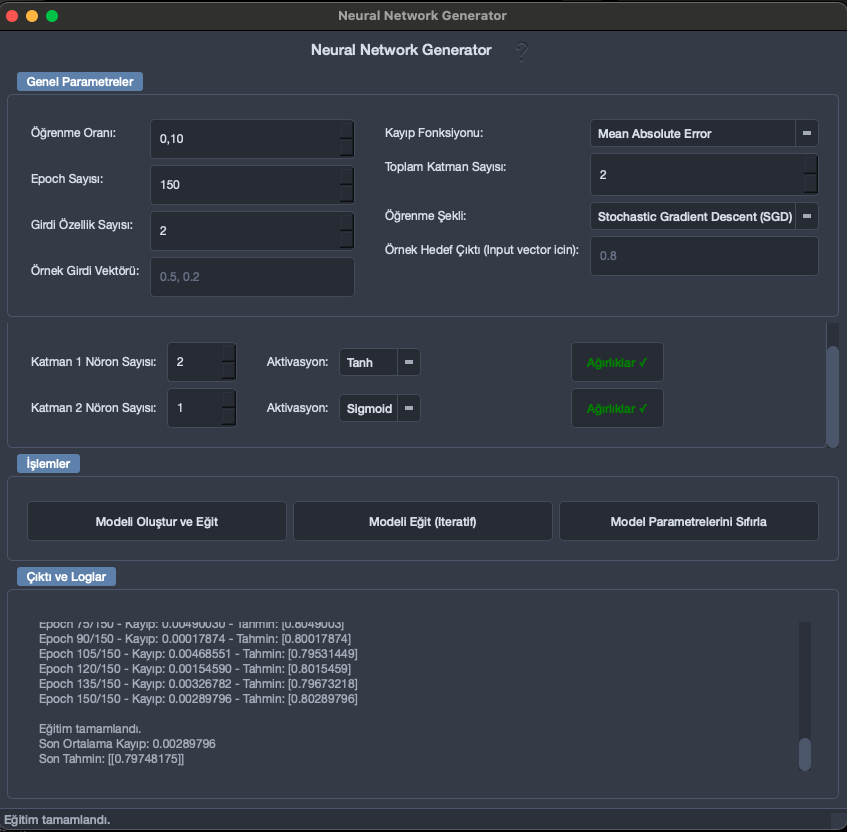
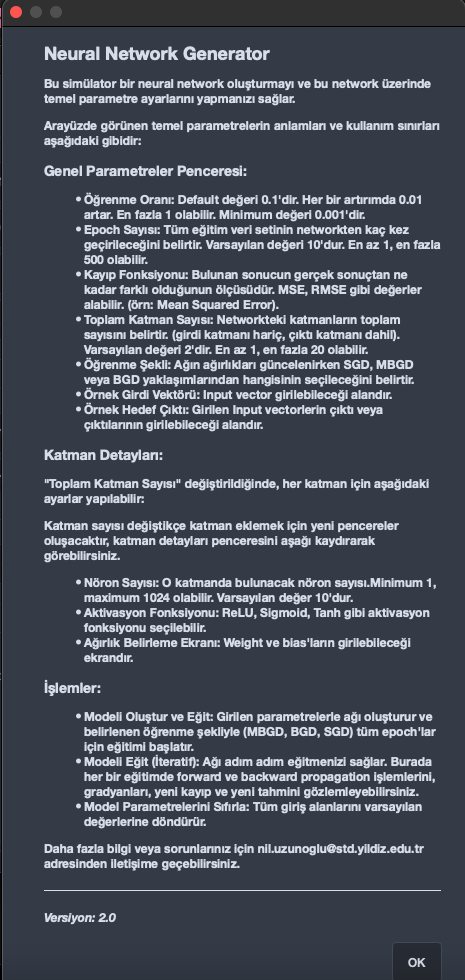

# NeuralNetworkGenerator (v2)



Neural Network Generator, bir arayüz kullanarak yapay sinir ağlarının oluşturulmasını ve görselleştirebilmesini sağlayan bir çalışmadır.

Bu uygulama üzerinden, kullanıcılar katman sayısından katman türlerine (giriş, çıkış, gizli katman gibi), aktivasyon fonksiyonlarından giriş/çıkış katmanlarındaki nöron sayısına kadar pek çok detayı bir arayüz kullanarak seçebilir ve kendi tasarladıkları nöral ağ ile çalışmalar yapabilirler.

Arka planda ise kullanıcı tercihlerini temel alarak ağı kuran bir altyapı çalışır. Bu altyapıda hazır derin öğrenme fonksiyonları kullanılmayacak, nöral ağ ve içerisinde kullanılan fonksiyonlar (aktivasyon, kayıp fonksiyonları gibi) temelden implemente edilecektir.

Uygulamanın frontend bölümü PyQt6 kullanılarak geliştirilmiştir. Backend bölümüne implementasyonlar numpy kullanarak yapılmıştır.

### Kurulum ve Çalıştırma

1.  **Depoyu Klonlayın:**
    ```bash
    git clone https://github.com/niluzunoglu/NeuralNetworkGenerator.git
    cd NeuralNetworkGenerator
    ```

2.  **Sanal Ortam Oluşturun ve Aktive Edin (Önerilir):**
    ```bash
    python -m venv venv

    # Windows için aktivasyon:
    # venv\Scripts\activate
    # macOS/Linux için aktivasyon:
    # source venv/bin/activate
    ```

3.  **Gerekli Kütüphaneleri Yükleyin:**
    Proje ana dizininde bir `requirements.txt` dosyası bulunmaktadır. Aşağıdaki komutla gerekli kütüphaneleri bu dosyayı kullanarak yükleyebilirsiniz.

    ```bash
    pip install -r requirements.txt
    ```

4.  **Uygulamayı Çalıştırın:**
    Projenin ana dizinindeyken (`app.py` dosyasının bulunduğu dizin):
    ```bash
    python app.py
    ```

### Nasıl Kullanılır?

Not: Daha detaylı bilgi için, uygulamayı çalıştırdığınızda, başlığın hemen yanında bulunan "?" ifadesine tıklayarak yardım pop-up'ını açabilirsiniz. Bu pop-up'ın içeriği helper_text.py dosyası içerisinde mevcuttur.

1.  Uygulamayı başlattığınızda, "Genel Parametreler" bölümünden öğrenme oranı, epoch sayısı, kayıp fonksiyonu ve toplam katman sayısını, girdi vektörünü ve output vektörünü ayarlayın.
2.  "Toplam Katman Sayısı" değiştikçe güncellenen "Katman Detayları" bölümünde her katman için nöron sayısı ve aktivasyon fonksiyonunu seçin.
3.  Ayarlarınızı tamamladıktan sonra, "İşlemler" bölümündeki:
    *   **"Modeli Oluştur ve Eğit"** butonuna tıklayarak girdiğiniz parametrelerle bir ağ
    oluşturulmasını ve eğitilmesini sağlayabilirsiniz. Oluşturulan parametreler "Çıktı ve Loglar" alanında gösterilecektir.
    *   **"Modeli Eğit (Iteratif)"** butonuna tıklayarak ağırlıkları güncelleyebilir, gradyan değerini, tahmin değerini (y_predicted) ve loss değerini görebilirsiniz.
    *   **"Model Parametrelerini Sıfırla"** butonuna tıklayarak tüm ayarları varsayılan değerlerine döndürebilirsiniz.
4.  "Çıktı ve Loglar" bölümünden ağ oluşturma ve eğitim süreciyle ilgili bilgileri takip edebilirsiniz.

Sorularınız için nil.uzunoglu@std.yildiz.edu.tr adresinden ulaşabilirsiniz.

### Örnek Ekran Görüntüleri



